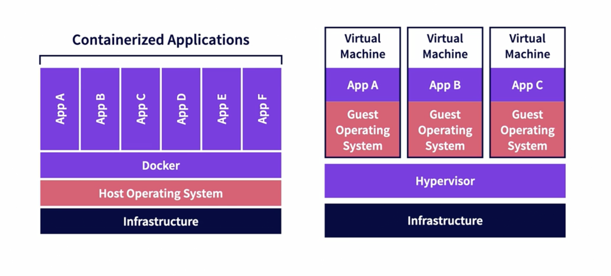
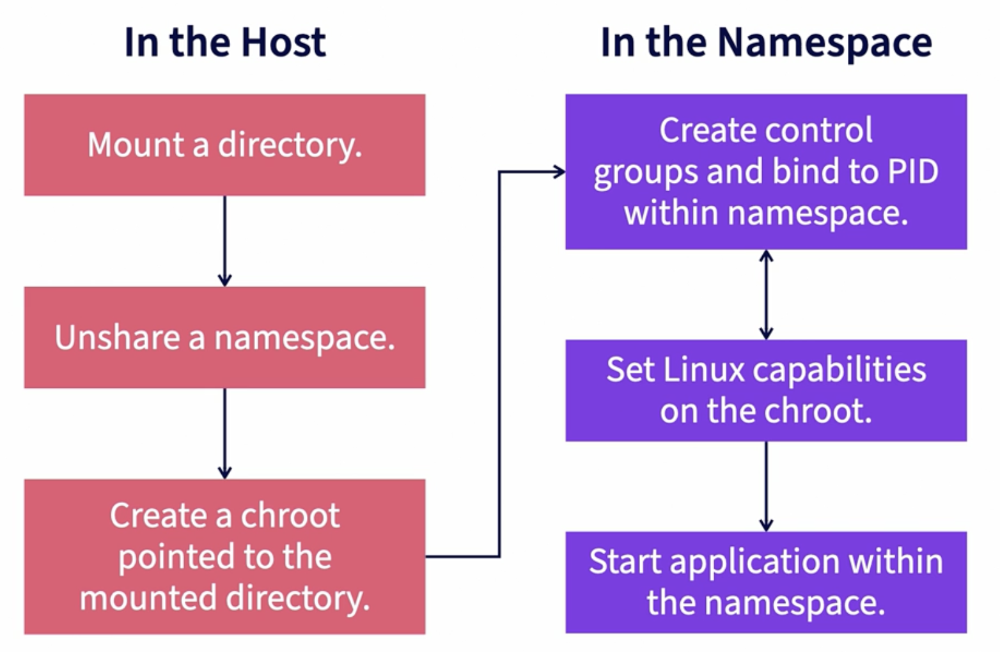

# Introduction to Docker

Sometimes we come across situations where a software runs on one machine but doesn't work on the other. This can happen because:
1. One or more files are missing
2. Software version mismatch
3. Different configuration settings
4. Hardware Dependencies

#### Previous Solutions
- Configuration Management Tools such as Chef, Puppet and Ansible. These require knowledge about Hardware and Operating Systems.
- Virtual Machines as Code (Vagrant). These are heavey, slow and require inconvenient configuration.

This is where Docker comes in as it allows you to package your application and run it on any machine that runs Docker. If someone joins your team, they don't need to install dependencies to run your application. They can use Docker to pull up your isolated application package and run it. You can run multiple application having different dependencies on the same machine.

**Docker makes containers easy:**
1. Configuration through Dockerfiles, not shell commands.
2. Share images with others through image registries.
3. A super easy command line client and API.

## Virtual Machines v/s Containers

#### Containers

- A container is an isolated environment for running an application.
- Run in container runtimes.
- Work alongside operating systems.
- Do not require OS configuration.
- Run one app at a time (usually).

#### Virtual Machines

- A virtual machine is an abstraction of a machine (physical hardware).
- We can run several virtual machines on a single physical machine.
- You can use a hypervisor to do this. It allows you to run multiple virtual machines and manage them.
- You can run applications in isolation.
- Each VM needs a full-blown OS.
- Slow to start.
- Resource intensive.

## Container Runtimes

Containers are composed of **Control Groups** and **Namespaces**. **Namespaces** define what resources containers can access on its host and **Control Groups** define how much of these resources containers can consume.

> **Container runtimes automate all of the above for us.**

- Container runtimes and container engines are often used interchangeably but there are slight differences in both of them.
- Container runtimes are a part of container engine.
- Container engine is responsible for the experience of using a container.

#### Container Runtimes

##### Can

- Create namespaces.
- Create and associate cgroups to namespaces (containers).
- Map filesystems to containers.
- Set container capabilities.
- Start, stop, and remove individual containers.

##### Cannot

- Build images.
- Pull images.
- Serve APIs for interacting with containers.

### OCI (Open Container Initiative) Runtimes

- OCI aims to standardize container technology, like container images and runtimes.
- The OCI Runtime Specification outlines what a container is and how it should be managed.
- Runtime spec does not dictate how to do these things.
- Runtime spec is open source and actively maintained.
- **runc** from Docker is the de facto industry standard conatiner runtime.
- **crun** is the Red Hat default container runtime and is written in C for performance.
- **youki** is a newer container runtime written in Rust.

### CRI (Container Runtime Interface) Runtimes

- CRI provides an API for running containers on container runtimes.
- This allows projects like Kubernetes to not be tied to any specific runtime or runtime standard.
- **containerd** is a popular CRI runtime that uses **runc** to create containers.
- **CRI-O** is a lightweight CRI runtime optimized for Kubernetes, maintained by RedHat, Intel and others.

## Docker Engine

- Container engines work alongside container runtimes to facilitate the management of containers.
- They provide tools and components for container management, including automation and configuration capabilities.

### Popular Container Engines:

### Docker Engine:
- Widely popular container engine.
- Includes the Docker command-line client.
- Utilizes Dockerfile syntax for creating container images.
- Provides an HTTP REST-based API for communication with container runtimes.
- Defaults to using the **containerd** runtime but allows for easy switching.

### Podman:
- Developed by Red Hat.
- Default container engine in Red Hat Enterprise Linux (RHEL).
- Functionally equivalent to Docker in most use cases.
- Uses **Buildah** instead of Dockerfile for creating container images.
- Defaults to **crun** as its runtime, but it can be changed easily.

## Where is Everything?
- **/var/lib/docker**: Containers, Volumes and Metadata
- **/var/lib/docker/overlay**: Container Volumes
- **/var/run/docker.sock**: The pipe between the Docker Client and Docker Engine
- **/etc/docker/daemon.json**: Docker Engine Configuration (might not exist at first).

## How does Docker work underneath the hood?