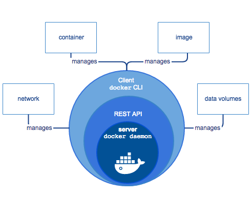

# Introduction to Docker

Sometimes we come across situations where a software runs on one machine but doesn't work on the other. This can happen because:

1. One or more files are missing
2. Software version mismatch
3. Different configuration settings
4. Hardware Dependencies

#### Previous Solutions

- Configuration Management Tools such as **Chef**, **Puppet** and **Ansible**. These require knowledge about Hardware and Operating Systems.
- **Virtual Machines as Code (Vagrant)**. These are heavy, slow and require inconvenient configuration.

This is where Docker comes in as it allows you to package your application and run it on any machine that runs Docker. If someone joins your team, they don't need to install dependencies to run your application. They can use Docker to pull up your isolated application package and run it. You can run multiple application having different dependencies on the same machine.

**Docker makes containers easy:**
1. Configuration through Dockerfiles, not shell commands.
2. Share images with others through image registries.
3. A super easy command line client and API.

## Virtual Machines v/s Containers


#### Containers

- A container is an isolated environment for running an application.
- Run in container runtimes.
- Work alongside operating systems.
- Do not require OS configuration.
- Run one app at a time (usually).

#### Virtual Machines

- A virtual machine is an abstraction of a machine (physical hardware).
- We can run several virtual machines on a single physical machine.
- You can use a hypervisor to do this. It allows you to run multiple virtual machines and manage them.
- You can run applications in isolation.
- Each VM needs a full-blown OS.
- Slow to start.
- Resource intensive.

## Container Runtimes

Containers are composed of **Control Groups** and **Namespaces**. **Namespaces** define what resources containers can access on its host and **Control Groups** define how much of these resources containers can consume.


> **Container runtimes automate all of the above for us.**

- Container runtimes and container engines are often used interchangeably but there are slight differences in both of them.
- Container runtimes are a part of container engine.
- Container engine is responsible for the experience of using a container.

#### Container Runtimes
<hr />

##### Can

- Create namespaces.
- Create and associate cgroups to namespaces (containers).
- Map filesystems to containers.
- Set container capabilities.
- Start, stop, and remove individual containers.

##### Cannot

- Build images.
- Pull images.
- Serve APIs for interacting with containers.
<hr />

### OCI (Open Container Initiative) Runtimes

- OCI aims to standardize container technology, like container images and runtimes.
- The OCI Runtime Specification outlines what a container is and how it should be managed.
- Runtime spec does not dictate how to do these things.
- Runtime spec is open source and actively maintained.
- **runc** from Docker is the de facto industry standard conatiner runtime.
- **crun** is the Red Hat default container runtime and is written in C for performance.
- **youki** is a newer container runtime written in Rust.

### CRI (Container Runtime Interface) Runtimes

- CRI provides an API for running containers on container runtimes.
- This allows projects like Kubernetes to not be tied to any specific runtime or runtime standard.
- **containerd** is a popular CRI runtime that uses **runc** to create containers.
- **CRI-O** is a lightweight CRI runtime optimized for Kubernetes, maintained by RedHat, Intel and others.

## Docker Engine

- Container engines work alongside container runtimes to facilitate the management of containers.
- They provide tools and components for container management, including automation and configuration capabilities.

### Popular Container Engines:

### Docker Engine:
- Widely popular container engine.
- Includes the Docker command-line client.
- Utilizes Dockerfile syntax for creating container images.
- Provides an HTTP REST-based API for communication with container runtimes.
- Defaults to using the **containerd** runtime but allows for easy switching.

### Podman:
- Developed by Red Hat.
- Default container engine in Red Hat Enterprise Linux (RHEL).
- Functionally equivalent to Docker in most use cases.
- Uses **Buildah** instead of Dockerfile for creating container images.
- Defaults to **crun** as its runtime, but it can be changed easily.

## Where is Everything?
- **/var/lib/docker**: Containers, Volumes and Metadata
- **/var/lib/docker/overlay**: Container Volumes
- **/var/run/docker.sock**: The pipe between the Docker Client and Docker Engine
- **/etc/docker/daemon.json**: Docker Engine Configuration (might not exist at first).

## How does Docker work underneath the hood?

### Docker Architecture



- Docker uses a client-server architecture. 
- The Docker client talks to the Docker daemon, which does the heavy lifting of building, running, and distributing your Docker containers.

#### Docker daemon

It listens to the API requests being made through the Docker client and manages Docker objects such as images, containers, networks, and volumes.

#### Docker client

This is what you use to interact with Docker. When you run a command using docker, the client sends the command to the daemon, which carries them out. The Docker client can communicate with more than one daemon.

#### Docker registries

This is where Docker images are stored. Docker Hub is a public registry that anyone can use. When you pull an image, Docker by default looks for it in the public registry and saves the image on your local system on DOCKER_HOST. You can also store images on your local machine or push them to the public registry.

### Dockerfile

- Describes steps to create a Docker image. 
- It’s like a recipe with all ingredients and steps necessary in making your dish. 
- This file can be used to create Docker Image. These images can be pulled to create containers in any environment. 
- These images can also be store online at docker hub. 
- When you run docker image you get docker containers. The container will have the application with all its dependencies.

```yaml
FROM ubuntu
MAINTAINER Aryan Khurana <aryankhurana2324@gmail.com>
RUN apt-get update
CMD [“echo”, “Hello World”]
```

### Docker Image

- A Docker Image is a file that defines a Docker Container. 
- It is similar in concept to a snapshot of a VM. 
- A container that moves from one Docker environment to another with the same OS will work without changes because the image includes all of the dependencies needed to execute the code.
- Docker Image is run to create a docker container. Images are immutable. Once built, the files making up an image do not change. Images can be stored locally or remote locations like hub.docker.com.
- Images are built in layers. Each layer is an immutable file, but is a collection of files and directories. 
- The last layer can be used to write out data to. 
- Layers receive an ID, calculated via a SHA 256 hash of the layer contents. Thus, if the layer contents change - Notice the IMAGE ID below and the Hash Values given above, the first 12 characters of the hash are equal to the IMAGE ID, the SHA 256 hash changes as well. 
> **Note:** The Image ID listed by docker commands (ie ‘docker images’) is the first 12 characters of the hash. These hash values are referred to by ‘tag’ names.
